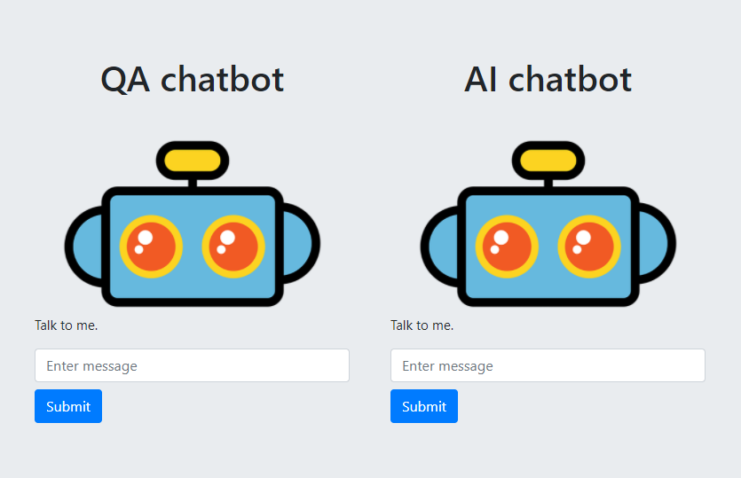
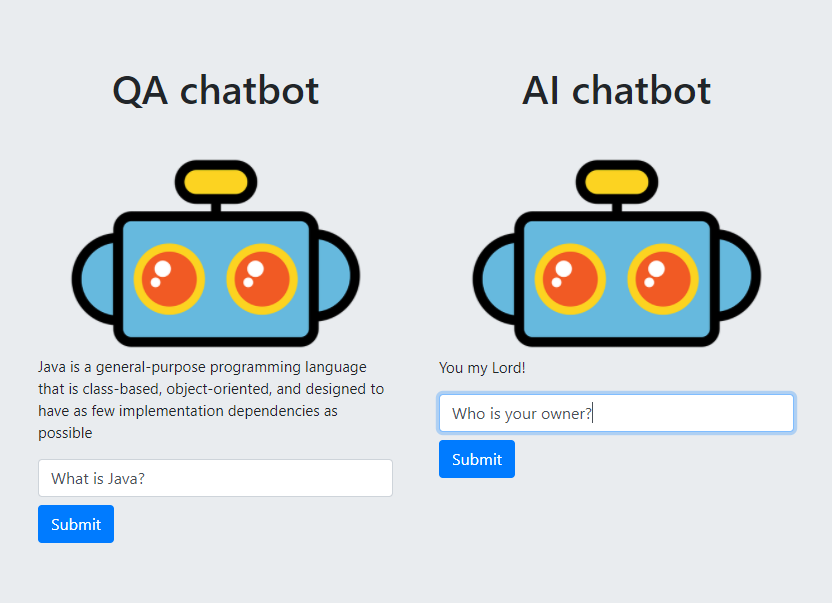

# What is the chatbot app
This application provides AI and QA chatbot. There is served a simple GUI for user to communicate with chatbots.
# AI chatbot
To develop this chatbot I used <code>chatterbot</code> library. Chatbot learns how he should respond from corpuses.
Chatterbot library offer some corpuses but you can also add your own. Take a look of <code>myCorpus.yaml</code> file.
# QA chatbot
This chatbot is looking for the first sentence of the first result in google search for user input. 
The results of chatbot could be not accurate to the question but for many examples response should satisfied user expectations.
# How to run the app
* Python 3.7 is recommended
* Run server by typing <code>python server.py</code> in console
* You should see logs in console similar to

    ...
    Training sports.yml: [####################] 100%
    Training trivia.yml: [####################] 100%
    Training myCorpus.yaml: [####################] 100%
    serving at port 8080
   
* Open <code>http://localhost:8080</code> to see GUI for conversation with chatbots
* Each input to bot and output from bot should be logged on console
# Screenshots

Just write some message, submit and wait for bot response!

